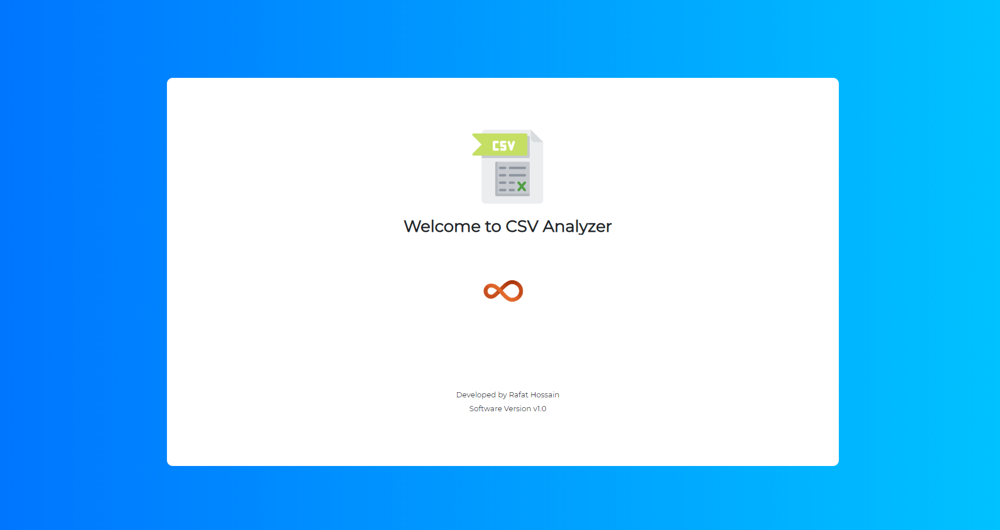
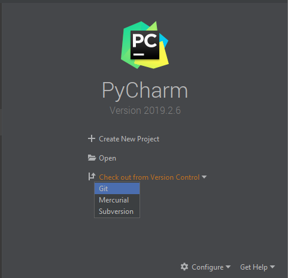

# CSV File Analyzer

This is a python based CSV file analyzer which will analyze csv file and give the output accordingly with the datamap.




## Download using git
```
https://github.com/rafathossain96/CSV-File-Analyzer.git
```

## Downloading in PyCharm
Open the Pycharm and select checkout from version control and paste the git url there. The project will be cloned to your desktop.

<div align="center">
  
 </div>

## Install the requirements.txt from the terminal
Before running the main.py, you need to install the requirements.
```
pip install -r requirements.txt
```

## Run the application
```
python main.py
```

## Browser Option in EEL
```
eel.start('index.html', mode='chrome-app', port=0, size=(1400, 900))
```
Here available modes are
```
1. edge
2. chrome
3. chrome-app
4. custom
```
<b>port=0</b> is to select the available free port automatically.

<b>size</b> refers to the screen size.

## Building the executbale file
Here is the command to create a standalone executable package.
```
python -m eel main.py web --onedir --noconsole --name="Name of the exe file" --icon=icon.ico
```

## Copyright
Copyright©2020 Rafat Hossain

Released under MIT License
